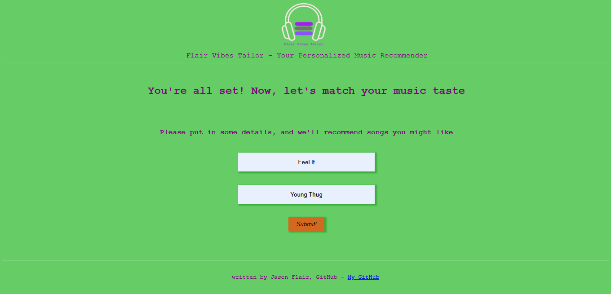

# Flair Vibes Tailor - Music Recommender
A simple web application that allows you to submit your favorite song and get recommended songs that match your taste in music.

This project serves as my portfolio project and showcases some of my skills in web development.

Link to the deployed product - <a href="http://web-01.jasonflair.tech" target="_blank">Click Me</a>

# Prerequisites
- Flask (with flask blueprint)
- Requests
- Flask-Cors
- jQuery

# Built With
- <a href="https://flask.palletsprojects.com/en/2.2.x/" target="_blank">Flask</a> - The web framework used
- <a href="https://docs.python-requests.org/en/latest/" target="_blank">Requests</a> - A python library for making HTTP requests
- <a href="https://flask-cors.readthedocs.io/en/latest/" target="_blank">Flask-CORS</a> - Flask extension for handling Cross Origin Resource Sharing (CORS)
- <a href="https://api.jquery.com/" target="_blank">jQuery</a> - Used to make the song recommendations render dynamically
- <a href="https://developer.spotify.com/" target="_blank">Spotify's api</a> - Used to explore audio features and audio analysis of tracks

# Data Source
The track details, audio features, and recommendations used in this project are provided by Spotify and harnessed through Spotify's api

# Getting Started
1. Clone the repository:

   `git clone https://github.com/jasonflair/flairvibes-tailor.git`
2. Change into the project directory:

   `cd FlairVibes_Tailor`
3. Run the flask app for the api:

   `CLIENT_ID='your_spotify_clientid' CLIENT_SECRET='your_spotify_clientsecret' python3 -m api.app`

# How the product works
<h3>Step 1: Put In Your Favourite Song's Details</h3>
          
Put in the song you can't get enough of right now as well as the artiste who made the song.

          
<h3>Step 2: Hit The Submit button to Get Personalized Recommendations</h3>
          
FVT will use Spotify's trusted API with carefully selected paramters to generate a list of songs tailored just for you.

<h3>Step 3: Listen and Enjoy</h3>
          
Check out the songs recommended and discover your new favourite artiste(s) or song(s)!.

          

# Author
Chukwuemelie 'Jason Flair' Obumse. Email - emelieobumse100@gmail.com, Twitter handle - <a href="https://twitter.com/jasonffs_" target="_blank"> My Twitter</a>

# License
This project is open for reading. However, if you wish to use any part of this project for commercial or public use, please obtain permission from the author. Unauthorized use of this project is strictly prohibited.
